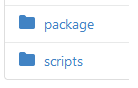
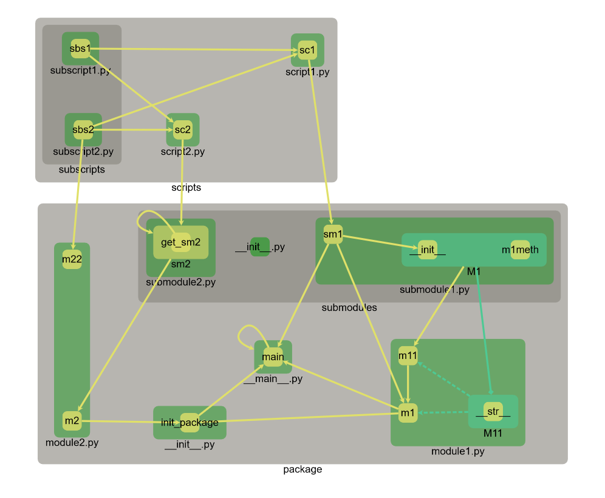

# ByParse

A library to parse python projects and build the graph of all symbolic connexions.

Instead of this:



It ables you to see this:



# Installation

```bash
pip install git+https://gitea.bycelium.com/vanyle/ByParse.git
```

# Usage

## Produce a graph

```bash
byparse -r path/to/project/root
```

For more details:

```bash
byparse --help
```

## Visualize a graph

### Using cytoscape

See [cytoscape usage](cytovis/README.md).
