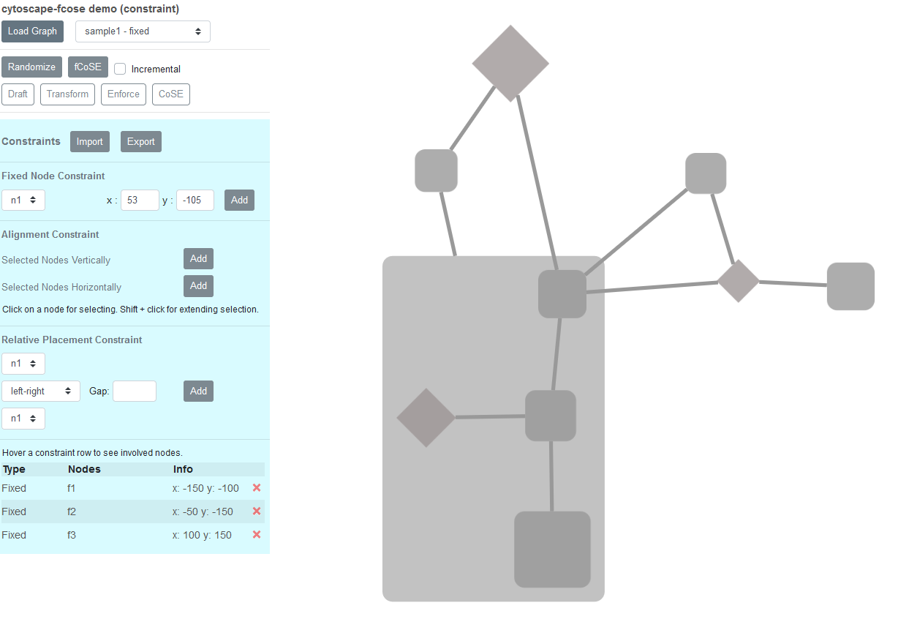
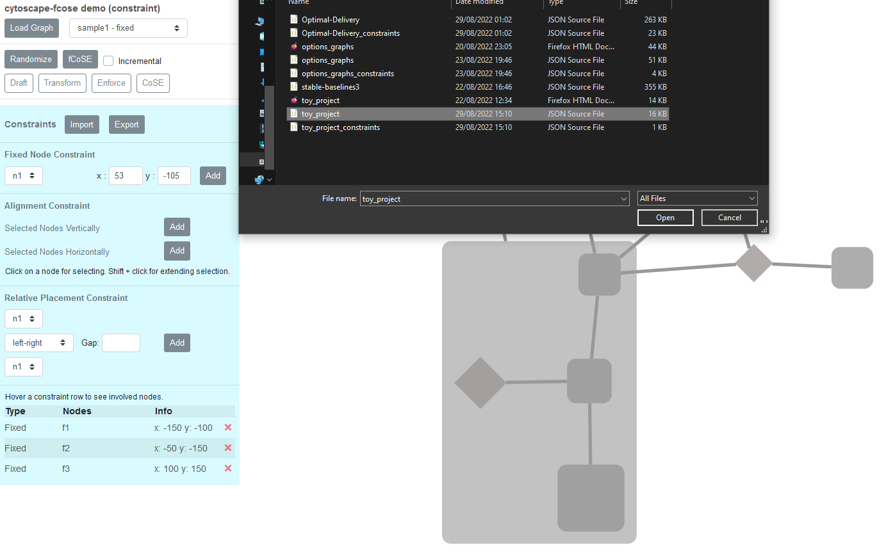
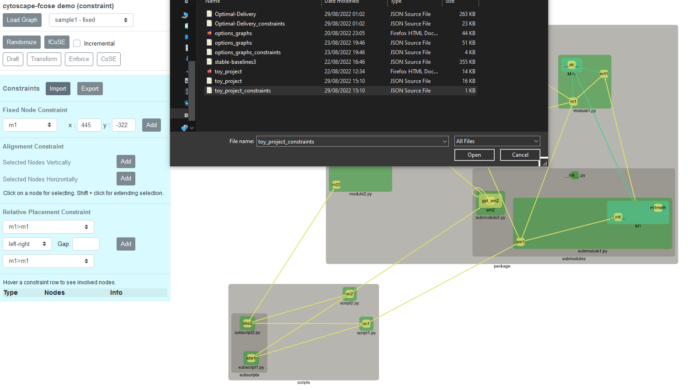
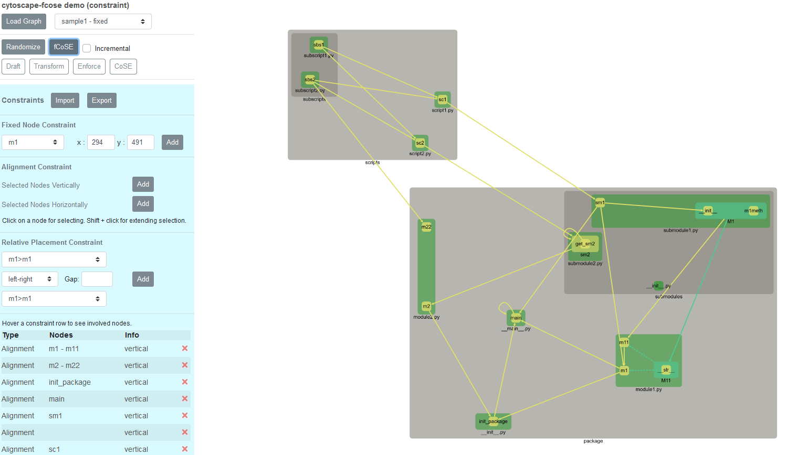
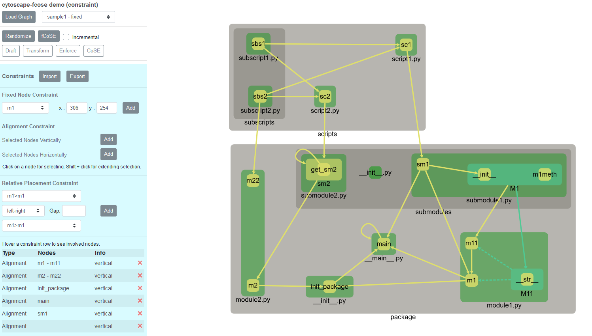

# Cytoscape.js based visualisation

## Usage

### Open interface

Open `demo-constraint.html` in browser

You get this:


### Parse a python project using byparse

```bash
python -m byparse -r path/to/project/root
```

Without the `-r` argument, it will parse the toy_project by default.

This will create two .json files, one for the graph,
one for constraints in an `examples_graphs` folder

### Load the graph

Click on the `Load Graph` button on the interface and select the created .json (without constraint).



You can already click on `fCoSE` to see the graph without any hand-made constraints.

### Load the constraints using the Load Graph

Click on the `Import` button on the interface in the blue box,
and select the created .json (with constraint).



Then press the `fCoSE` button to oranise the graph automaticaly.



Drag & drop nodes to make the graph prettier as yo wish !


